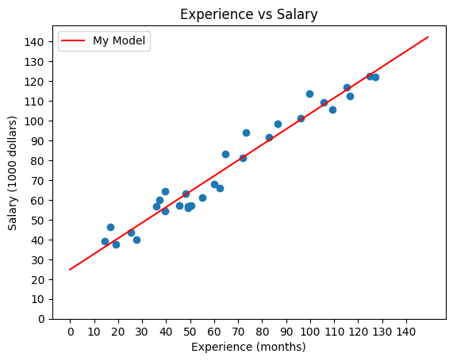
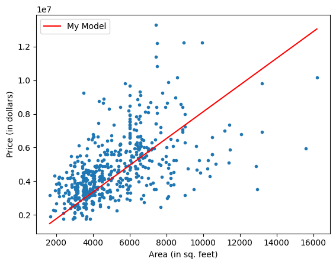

# Linear Regression Model

This project demonstrates the implementation of Linear Regression using the batch gradient descent algorithm. The goal is to predict the best fit line for datasets.

## Objectives
1. Implement a Linear Regression model from scratch.
2. Use the `sklearn` model.
3. Calculate the Mean Squared and Root Mean Squared Error.

## Datasets
- [Salary Dataset](https://www.kaggle.com/datasets/syamalapadala/salary-dataset)
- [Housing Prices Dataset](https://www.kaggle.com/datasets/yasserh/housing-prices-dataset?select=Housing.csv)

## Implementation Details

### Custom Linear Regression Model

- Compute the weight and bias for 1 feature.
- Give Predictions based on the best fit line.
- Evaluate model accuracy.

### Sklearn KNN Model
- The `linear_model` from `sklearn` is also used for the same. 

## Results
- The results of the custom model and the sklearn model were more or less the same.
- **Salary Dataset**:
  - Root Mean Squared Error = 5.59
  

- **Housing Price Dataset**:
  - Root Mean Squared Error = 169529.13
  
## Made By-
**Yash Kumar**
- [**GitHub**](https://github.com/yashk1690)
- [**LinkedIn**](https://www.linkedin.com/in/yash-kumar-504649323)

